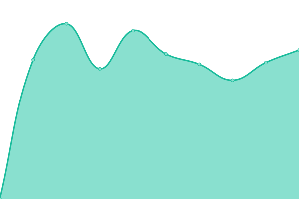

# [📈 Live Status](https://status.danteb.com): <!--live status--> **🟩 All systems operational**

This repository contains the open-source uptime monitor and status page for [Dante Barbieri](dantebarbieri.dev), powered by [Upptime](https://github.com/upptime/upptime).

With [Upptime](https://upptime.js.org), you can get your own unlimited and free uptime monitor and status page, powered entirely by a GitHub repository. We use [Issues](https://github.com/dantebarbieri/homeserver-status/issues) as incident reports, [Actions](https://github.com/dantebarbieri/homeserver-status/actions) as uptime monitors, and [Pages](https://status.danteb.com) for the status page.

<!--start: status pages-->
<!-- This summary is generated by Upptime (https://github.com/upptime/upptime) -->
<!-- Do not edit this manually, your changes will be overwritten -->
<!-- prettier-ignore -->
| URL | Status | History | Response Time | Uptime |
| --- | ------ | ------- | ------------- | ------ |
|  [Plex](https://plex.danteb.com) | 🟩 Up | [plex.yml](https://github.com/dantebarbieri/homeserver-status/commits/HEAD/history/plex.yml) | 

 262ms
     
 | 

<a href="https://status.danteb.com/history/plex">99.51%</a>
    

|  [Jellyfin](https://jellyfin.danteb.com) | 🟩 Up | [jellyfin.yml](https://github.com/dantebarbieri/homeserver-status/commits/HEAD/history/jellyfin.yml) | 

 326ms
     
 | 

<a href="https://status.danteb.com/history/jellyfin">100.00%</a>
    

|  [Seerr](https://seerr.danteb.com) | 🟩 Up | [seerr.yml](https://github.com/dantebarbieri/homeserver-status/commits/HEAD/history/seerr.yml) | 

 595ms
     
 | 

<a href="https://status.danteb.com/history/seerr">100.00%</a>
    

|  [Immich](https://immich.danteb.com) | 🟩 Up | [immich.yml](https://github.com/dantebarbieri/homeserver-status/commits/HEAD/history/immich.yml) | 

 246ms
     
 | 

<a href="https://status.danteb.com/history/immich">100.00%</a>
    

|  [Komga](https://komga.danteb.com) | 🟩 Up | [komga.yml](https://github.com/dantebarbieri/homeserver-status/commits/HEAD/history/komga.yml) | 

 291ms
     
 | 

<a href="https://status.danteb.com/history/komga">100.00%</a>
    

|  [Calibre](https://calibre.danteb.com) | 🟩 Up | [calibre.yml](https://github.com/dantebarbieri/homeserver-status/commits/HEAD/history/calibre.yml) | 

 347ms
     
 | 

<a href="https://status.danteb.com/history/calibre">100.00%</a>
    

|  [Suwayomi](https://suwayomi.danteb.com) | 🟩 Up | [suwayomi.yml](https://github.com/dantebarbieri/homeserver-status/commits/HEAD/history/suwayomi.yml) | 

 321ms
     
 | 

<a href="https://status.danteb.com/history/suwayomi">100.00%</a>
    

|  [Radarr](https://radarr.danteb.com) | 🟩 Up | [radarr.yml](https://github.com/dantebarbieri/homeserver-status/commits/HEAD/history/radarr.yml) | 

 360ms
     
 | 

<a href="https://status.danteb.com/history/radarr">100.00%</a>
    

|  [Sonarr](https://sonarr.danteb.com) | 🟩 Up | [sonarr.yml](https://github.com/dantebarbieri/homeserver-status/commits/HEAD/history/sonarr.yml) | 

 291ms
     
 | 

<a href="https://status.danteb.com/history/sonarr">100.00%</a>
    

|  [Bazarr](https://bazarr.danteb.com) | 🟩 Up | [bazarr.yml](https://github.com/dantebarbieri/homeserver-status/commits/HEAD/history/bazarr.yml) | 

 282ms
     
 | 

<a href="https://status.danteb.com/history/bazarr">100.00%</a>
    

|  [Prowlarr](https://prowlarr.danteb.com) | 🟩 Up | [prowlarr.yml](https://github.com/dantebarbieri/homeserver-status/commits/HEAD/history/prowlarr.yml) | 

 329ms
     
 | 

<a href="https://status.danteb.com/history/prowlarr">100.00%</a>
    

|  [Tdarr](https://tdarr.danteb.com) | 🟩 Up | [tdarr.yml](https://github.com/dantebarbieri/homeserver-status/commits/HEAD/history/tdarr.yml) | 

 226ms
     
 | 

<a href="https://status.danteb.com/history/tdarr">100.00%</a>
    

|  [qBittorrent](https://qbittorrent.danteb.com) | 🟩 Up | [q-bittorrent.yml](https://github.com/dantebarbieri/homeserver-status/commits/HEAD/history/q-bittorrent.yml) | 

 219ms
     
 | 

<a href="https://status.danteb.com/history/q-bittorrent">100.00%</a>
    

|  [SABnzbd](https://sabnzbd.danteb.com) | 🟩 Up | [sa-bnzbd.yml](https://github.com/dantebarbieri/homeserver-status/commits/HEAD/history/sa-bnzbd.yml) | 

 277ms
     
 | 

<a href="https://status.danteb.com/history/sa-bnzbd">100.00%</a>
    

|  [SearXNG](https://searxng.danteb.com) | 🟩 Up | [sear-xng.yml](https://github.com/dantebarbieri/homeserver-status/commits/HEAD/history/sear-xng.yml) | 

 249ms
     
 | 

<a href="https://status.danteb.com/history/sear-xng">100.00%</a>
    

|  [Element](https://element.danteb.com) | 🟩 Up | [element.yml](https://github.com/dantebarbieri/homeserver-status/commits/HEAD/history/element.yml) | 

 222ms
     
 | 

<a href="https://status.danteb.com/history/element">100.00%</a>
    

|  [Matrix](https://matrix.danteb.com) | 🟩 Up | [matrix.yml](https://github.com/dantebarbieri/homeserver-status/commits/HEAD/history/matrix.yml) | 

 380ms
     
 | 

<a href="https://status.danteb.com/history/matrix">100.00%</a>
    

|  [Nginx Proxy Manager](https://nginx-proxy-manager.danteb.com) | 🟩 Up | [nginx-proxy-manager.yml](https://github.com/dantebarbieri/homeserver-status/commits/HEAD/history/nginx-proxy-manager.yml) | 

 449ms
     
 | 

<a href="https://status.danteb.com/history/nginx-proxy-manager">100.00%</a>
    

|  [Authelia](https://authelia.danteb.com) | 🟩 Up | [authelia.yml](https://github.com/dantebarbieri/homeserver-status/commits/HEAD/history/authelia.yml) | 

 214ms
     
 | 

<a href="https://status.danteb.com/history/authelia">100.00%</a>
    

|  [AdGuard Home](https://adguardhome.danteb.com) | 🟩 Up | [ad-guard-home.yml](https://github.com/dantebarbieri/homeserver-status/commits/HEAD/history/ad-guard-home.yml) | 

 282ms
     
 | 

<a href="https://status.danteb.com/history/ad-guard-home">100.00%</a>
    

|  [WireGuard](https://wireguard.danteb.com) | 🟩 Up | [wire-guard.yml](https://github.com/dantebarbieri/homeserver-status/commits/HEAD/history/wire-guard.yml) | 

 348ms
     
 | 

<a href="https://status.danteb.com/history/wire-guard">100.00%</a>
    

|  [Uptime Kuma](https://uptime.danteb.com) | 🟩 Up | [uptime-kuma.yml](https://github.com/dantebarbieri/homeserver-status/commits/HEAD/history/uptime-kuma.yml) | 

 298ms
     
 | 

<a href="https://status.danteb.com/history/uptime-kuma">100.00%</a>
    

|  [Nextcloud](https://cloud.danteb.com) | 🟩 Up | [nextcloud.yml](https://github.com/dantebarbieri/homeserver-status/commits/HEAD/history/nextcloud.yml) | 

 459ms
     
 | 

<a href="https://status.danteb.com/history/nextcloud">100.00%</a>
    

|  [Vaultwarden](https://vaultwarden.danteb.com) | 🟩 Up | [vaultwarden.yml](https://github.com/dantebarbieri/homeserver-status/commits/HEAD/history/vaultwarden.yml) | 

 296ms
     
 | 

<a href="https://status.danteb.com/history/vaultwarden">100.00%</a>
    

|  [Syncthing](https://syncthing.danteb.com) | 🟩 Up | [syncthing.yml](https://github.com/dantebarbieri/homeserver-status/commits/HEAD/history/syncthing.yml) | 

 348ms
     
 | 

<a href="https://status.danteb.com/history/syncthing">100.00%</a>
    

|  [ntfy](https://ntfy.danteb.com) | 🟩 Up | [ntfy.yml](https://github.com/dantebarbieri/homeserver-status/commits/HEAD/history/ntfy.yml) | 

 252ms
     
 | 

<a href="https://status.danteb.com/history/ntfy">100.00%</a>
    

|  [Dashdot](https://dashdot.danteb.com) | 🟩 Up | [dashdot.yml](https://github.com/dantebarbieri/homeserver-status/commits/HEAD/history/dashdot.yml) | 

 447ms
     
 | 

<a href="https://status.danteb.com/history/dashdot">100.00%</a>
    

|  [IT-Tools](https://tools.danteb.com) | 🟩 Up | [it-tools.yml](https://github.com/dantebarbieri/homeserver-status/commits/HEAD/history/it-tools.yml) | 

 247ms
     
 | 

<a href="https://status.danteb.com/history/it-tools">100.00%</a>
    

|  [Code Server](https://code.danteb.com) | 🟩 Up | [code-server.yml](https://github.com/dantebarbieri/homeserver-status/commits/HEAD/history/code-server.yml) | 

 279ms
     
 | 

<a href="https://status.danteb.com/history/code-server">100.00%</a>
    

|  [Forgejo](https://git.danteb.com) | 🟩 Up | [forgejo.yml](https://github.com/dantebarbieri/homeserver-status/commits/HEAD/history/forgejo.yml) | 

 272ms
     
 | 

<a href="https://status.danteb.com/history/forgejo">100.00%</a>
    

|  [Travel Planner](https://travel.danteb.com) | 🟩 Up | [travel-planner.yml](https://github.com/dantebarbieri/homeserver-status/commits/HEAD/history/travel-planner.yml) | 

 222ms
     
 | 

<a href="https://status.danteb.com/history/travel-planner">100.00%</a>
    

|  [Homepage](https://homepage.danteb.com) | 🟩 Up | [homepage.yml](https://github.com/dantebarbieri/homeserver-status/commits/HEAD/history/homepage.yml) | 

 329ms
     
 | 

<a href="https://status.danteb.com/history/homepage">100.00%</a>
    

<!--end: status pages-->

[**Visit our status website →**](https://status.danteb.com)

## 📄 License

- Powered by: [Upptime](https://github.com/upptime/upptime)
- Code: [MIT](./LICENSE) © [Anand Chowdhary](https://anandchowdhary.com), supported by [Pabio](https://pabio.com)
- Data in the `./history` directory: [Open Database License](https://opendatacommons.org/licenses/odbl/1-0/)
